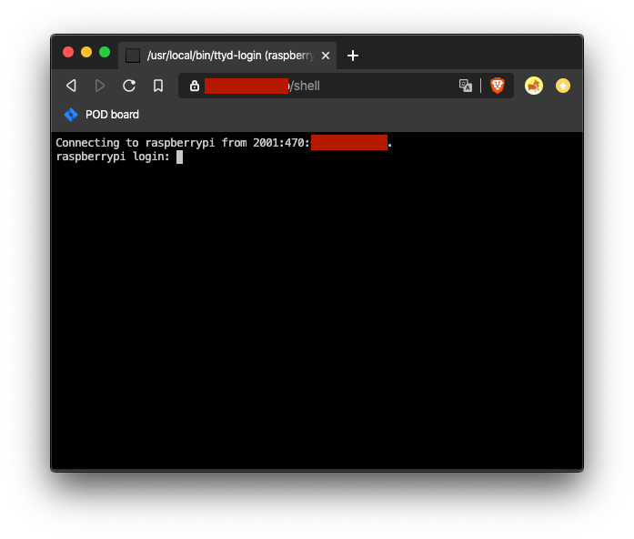

<!--
Este archivo README esta generado automaticamente<https://github.com/YunoHost/apps/tree/master/tools/readme_generator>
No se debe editar a mano.
-->

# httpsh on ttyd para Yunohost

[](https://dash.yunohost.org/appci/app/httpsh)  

[](https://install-app.yunohost.org/?app=httpsh)

*[Leer este README en otros idiomas.](./ALL_README.md)*

> *Este paquete le permite instalarhttpsh on ttyd rapidamente y simplement en un servidor YunoHost.*  
> *Si no tiene YunoHost, visita [the guide](https://yunohost.org/install) para aprender como instalarla.*

## Descripción general

This package is based on two projects:

* [ttyd](https://tsl0922.github.io/ttyd) is a TTY (terminal) web server
* [httpsh](https://github.com/leshniak/httpsh) is a login script that is called by ttyd


**Versión actual:** 1.7.4~ynh3

## Capturas



## Documentaciones y recursos

- Documentación administrador oficial: <https://github.com/tsl0922/ttyd/wiki/Example-Usage>
- Repositorio del código fuente oficial de la aplicación : <https://github.com/leshniak/httpsh>
- Catálogo YunoHost: <https://apps.yunohost.org/app/httpsh>
- Reportar un error: <https://github.com/YunoHost-Apps/httpsh_ynh/issues>

## Información para desarrolladores

Por favor enviar sus correcciones a la [`branch testing`](https://github.com/YunoHost-Apps/httpsh_ynh/tree/testing

Para probar la rama `testing`, sigue asÍ:

```bash
sudo yunohost app install https://github.com/YunoHost-Apps/httpsh_ynh/tree/testing --debug
o
sudo yunohost app upgrade httpsh -u https://github.com/YunoHost-Apps/httpsh_ynh/tree/testing --debug
```

**Mas informaciones sobre el empaquetado de aplicaciones:** <https://yunohost.org/packaging_apps>
